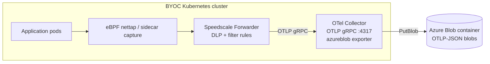

# Speedscale BYOC — Azure Blob Storage data-lake

Speedscale captures inbound + outbound traffic in the cluster and ships
RRPair logs through an OpenTelemetry Collector to an **Azure Blob Storage**
container. Use this scenario when you want a durable object-storage archive of
every observed request/response — for compliance retention, downstream
replay/training pipelines, or batch analytics — instead of (or in addition to)
a live query backend like Elasticsearch or Loki.

The collector's native `azureblob` exporter writes blobs directly; no Fluent
Bit and no in-cluster storage.

## Architecture



`charts/grafana/` and `charts/elasticsearch/` (sibling scenarios) are live-query
backends — you see traffic in a dashboard. This scenario is the **archive**
path: data lands as OTLP-JSON blobs in Azure Blob Storage, ready for cheap
long-term retention and batch consumption. It mirrors the `fluentbit-gcs` and
`fluentbit-s3` object-store charts, swapping the `awss3` exporter for
`azureblob`.

## Why pick this over `grafana` or `elasticsearch`?

Pick `azureblob` when:

- You need **durable retention** of every RRPair (compliance, audit, forensic replay) without paying ES/Loki hot-storage prices.
- You want to **feed downstream pipelines** — analytics, ML training corpora, proxymock snapshot generation — from a single canonical blob corpus.
- You want **lifecycle management** (auto-tier to Cool/Archive) that Azure Blob Storage handles natively.

Pick `grafana` or `elasticsearch` when you need an interactive dashboard / live query UI.

The scenarios coexist in their own namespaces; flip the forwarder's
`byoc_azure.otel_endpoint` to switch which one receives traffic.

> **Collector image is newer than the sibling charts.** The `azureblob`
> exporter is **alpha** and was added to opentelemetry-collector-contrib in
> **v0.121.0**, so the `0.108.0` image used by the GCS/S3 charts does not
> contain it. This chart pins `otel/opentelemetry-collector-contrib:0.123.0`,
> a released tag that includes the exporter.

## Prerequisites

1. **Azure Storage account** in a subscription you control:
   ```bash
   az storage account create \
     --name mystorageacct \
     --resource-group my-rg \
     --location eastus \
     --sku Standard_LRS
   ```

2. **Blob container** to hold the RRPairs:
   ```bash
   az storage container create \
     --name byoc \
     --account-name mystorageacct
   ```

3. **Connection string** for the storage account:
   ```bash
   az storage account show-connection-string \
     --name mystorageacct \
     --resource-group my-rg \
     --query connectionString -o tsv
   # DefaultEndpointsProtocol=https;AccountName=...;AccountKey=...;EndpointSuffix=core.windows.net
   ```

4. **Kubernetes Secret** with the connection string (chart references it; does NOT manage it):
   ```bash
   kubectl create namespace byoc-azureblob
   kubectl -n byoc-azureblob create secret generic byoc-azureblob \
     --from-literal=connectionString='DefaultEndpointsProtocol=https;AccountName=...;AccountKey=...;EndpointSuffix=core.windows.net'
   ```

## Install

```bash
helm repo add speedscale https://speedscale.github.io/operator-helm/
helm repo add speedscale-byoc https://speedscale.github.io/speedscale-byoc/
helm repo update

# Speedscale Operator + Forwarder
helm upgrade --install speedscale-operator speedscale/speedscale-operator \
  -n speedscale --create-namespace \
  --set apiKeySecret=speedscale-apikey \
  --set clusterName=<YOUR_CLUSTER_NAME> \
  --set 'forwarder.exporters.byoc_azure.otel_endpoint=http://otel-collector.byoc-azureblob.svc.cluster.local:4317' \
  --set 'forwarder.exporters.byoc_azure.filter_rule=standard' \
  --set 'forwarder.exporters.byoc_azure.dlp_config_id=standard'

# OTel Collector → Azure Blob Storage
helm upgrade --install byoc-azureblob speedscale-byoc/azureblob \
  -n byoc-azureblob --create-namespace \
  --set azure.url=https://mystorageacct.blob.core.windows.net/ \
  --set azure.container=byoc
```

Annotate a workload to capture its traffic:

```bash
kubectl patch deployment my-app -p '{"spec":{"template":{"metadata":{"annotations":{"capture.speedscale.com/enabled":"true"}}}}}'
```

## Verify

**1. Forwarder is wired**

```bash
kubectl -n speedscale get cm speedscale-forwarder \
  -o jsonpath='{.data.EXPORTERS}' | jq .
```

Expected: JSON with `byoc_azure` and `otel_endpoint` pointing at `byoc-azureblob`.

**2. OTel Collector is receiving logs**

```bash
kubectl -n byoc-azureblob logs deploy/otel-collector --tail=50 | grep -E 'LogsExporter|log_records'
```

Non-zero `log_records` = Forwarder is delivering. Zero = check endpoint and port.

**3. Collector is exporting to Azure Blob**

```bash
kubectl -n byoc-azureblob logs deploy/otel-collector --tail=50 | grep -iE 'azureblob|export|error'
```

Successful exports log without errors. `authentication`/`connection string`
errors point at the Secret; `403` points at the container or account key.

**4. Blobs appear in the container**

```bash
az storage blob list \
  --account-name mystorageacct \
  --container-name byoc \
  --connection-string '<conn-string>' \
  --output table | tail -10
```

New blobs appear within ~30s of traffic flowing.

**5. Peek at a record**

```bash
az storage blob download \
  --account-name mystorageacct \
  --container-name byoc \
  --connection-string '<conn-string>' \
  --name <blob-name> --file - 2>/dev/null | jq '.resourceLogs[0]' | head
```

## Troubleshoot

**`EXPORTERS` is null or missing `byoc_azure`**

Values weren't applied. Ensure you passed `forwarder.exporters.byoc_azure.*` on `helm upgrade`, then restart: `kubectl -n speedscale rollout restart deploy/speedscale-forwarder`.

**OTel Collector not receiving records**

- Port must be **4317** (gRPC). `4318` is the HTTP port — wrong for the Forwarder's gRPC dial.
- Namespace in the endpoint must match where you installed the chart.

**`http://` prefix required on `otel_endpoint`**

Always use `http://otel-collector.<namespace>.svc.cluster.local:4317`, not a bare `host:port`.

**Unknown exporter `azureblob` / collector crashloops on startup**

The `azureblob` exporter is alpha and only exists in opentelemetry-collector-contrib **v0.121.0+**. If you overrode `image.otelCollector` to an older tag (e.g. the 0.108.0 used by the GCS/S3 charts), the collector won't recognize the exporter. Use 0.121.0 or newer; this chart defaults to 0.123.0.

**Authentication errors**

The exporter authenticates from the connection string. Confirm the Secret
`byoc-azureblob` has a `connectionString` key whose value is the full
`DefaultEndpointsProtocol=...;AccountName=...;AccountKey=...;EndpointSuffix=...`
string (not just the account key).

**`403` / authorization failed**

- Confirm the container exists and matches `azure.container` exactly (case-sensitive).
- Confirm the `AccountKey` in the connection string is current — rotated keys invalidate old connection strings.

**No blobs appearing after several minutes**

Check collector logs for export errors. If logs show successful exports but
blobs don't appear, verify `azure.container` matches the real container name and
the connection string's `AccountName` matches `azure.url`.

## Upgrade

```bash
helm repo update speedscale-byoc
helm upgrade byoc-azureblob speedscale-byoc/azureblob -n byoc-azureblob --reuse-values \
  --set azure.url=https://mystorageacct.blob.core.windows.net/ \
  --set azure.container=byoc
```

Blobs already in Azure Blob Storage are unaffected by chart upgrades. Check the
[CHANGELOG](CHANGELOG.md) for breaking changes before upgrading — note this
chart tracks a newer collector image than the sibling charts.

## Configuration reference

| Key | Default | Description |
|---|---|---|
| `azure.url` | `https://CHANGEME.blob.core.windows.net/` | Storage account blob URL. `connection_string` overrides this, but it must be set. |
| `azure.container` | `byoc` | Blob container to write RRPairs into (must exist before installing) |
| `azure.connectionStringSecret` | `byoc-azureblob` | Name of the K8s Secret with the `connectionString` key |
| `image.otelCollector` | `otel/opentelemetry-collector-contrib:0.123.0` | OTel Collector image — must be contrib **≥ 0.121.0** (azureblob exporter is alpha and contrib-only) |
