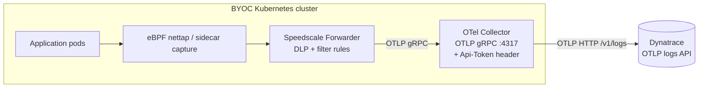

# Speedscale BYOC — OTel Collector → Dynatrace

Speedscale captures inbound + outbound traffic in the cluster and ships
RRPair logs through an OpenTelemetry Collector to your **Dynatrace**
environment's OTLP ingest API. Use this scenario when Dynatrace is already
your observability platform and you want every observed request/response to
land as OTLP logs you can query in Dynatrace Logs and Notebooks alongside the
rest of your telemetry.

This is a **collector-only** backend: Dynatrace is external SaaS, so there is
no in-cluster storage or UI and no Fluent Bit. The chart installs just the
OTel Collector that receives RRPairs from the Forwarder and forwards them to
Dynatrace — adding the `Api-Token` Authorization header the Forwarder can't.

## Architecture



The sibling `charts/grafana/` and `charts/elasticsearch/` are self-hosted
live-query backends; `charts/fluentbit-gcs/` is an object-storage archive.
This chart targets an external SaaS — pick it when Dynatrace is your system of
record. The scenarios coexist in their own namespaces; flip the Forwarder's
`byoc_dynatrace.otel_endpoint` to switch which one receives traffic.

## Prerequisites

1. **A Dynatrace environment** (SaaS or Managed) and its OTLP base URL:
   - SaaS: `https://<env-id>.live.dynatrace.com/api/v2/otlp`
   - Managed: `https://<your-domain>/e/<env-id>/api/v2/otlp`

2. **An API token with the `logs.ingest` scope**
   (Dynatrace > **Access Tokens** > Generate new token). Copy the token
   value (`dt0c01...`) — it is shown only once.

3. **Kubernetes Secret** holding the token (chart references it; does NOT
   manage it):
   ```bash
   kubectl create namespace byoc-dynatrace
   kubectl -n byoc-dynatrace create secret generic byoc-dynatrace \
     --from-literal=apiToken=dt0c01...
   ```

## Install

```bash
helm repo add speedscale https://speedscale.github.io/operator-helm/
helm repo add speedscale-byoc https://speedscale.github.io/speedscale-byoc/
helm repo update

# Speedscale Operator + Forwarder
helm upgrade --install speedscale-operator speedscale/speedscale-operator \
  -n speedscale --create-namespace \
  --set apiKeySecret=speedscale-apikey \
  --set clusterName=<YOUR_CLUSTER_NAME> \
  --set 'forwarder.exporters.byoc_dynatrace.otel_endpoint=http://otel-collector.byoc-dynatrace.svc.cluster.local:4317' \
  --set 'forwarder.exporters.byoc_dynatrace.filter_rule=standard' \
  --set 'forwarder.exporters.byoc_dynatrace.dlp_config_id=standard'

# OTel Collector → Dynatrace
helm upgrade --install byoc-dynatrace speedscale-byoc/dynatrace \
  -n byoc-dynatrace --create-namespace \
  --set dynatrace.endpoint=https://<env-id>.live.dynatrace.com/api/v2/otlp
```

Annotate a workload to capture its traffic:

```bash
kubectl patch deployment my-app -p '{"spec":{"template":{"metadata":{"annotations":{"capture.speedscale.com/enabled":"true"}}}}}'
```

## Wire the Forwarder

The Forwarder ships RRPairs over **OTLP gRPC** to this chart's collector. Set
these on the Operator install (shown above):

| Setting | Value |
|---|---|
| `forwarder.exporters.byoc_dynatrace.otel_endpoint` | `http://otel-collector.byoc-dynatrace.svc.cluster.local:4317` |
| `forwarder.exporters.byoc_dynatrace.filter_rule` | `standard` |
| `forwarder.exporters.byoc_dynatrace.dlp_config_id` | `standard` |

Always use the `http://...:4317` form (gRPC) — not a bare `host:port`, and not
the `4318` HTTP port. The collector, not the Forwarder, adds the Dynatrace
`Api-Token` header.

## Verify

**1. Forwarder is wired**

```bash
kubectl -n speedscale get cm speedscale-forwarder \
  -o jsonpath='{.data.EXPORTERS}' | jq .
```

Expected: JSON with `byoc_dynatrace` and `otel_endpoint` pointing at
`byoc-dynatrace`.

**2. OTel Collector is receiving and exporting logs**

```bash
kubectl -n byoc-dynatrace logs deploy/otel-collector --tail=50 \
  | grep -E 'LogsExporter|log_records'
```

Non-zero `log_records` = the Forwarder is delivering and the collector is
exporting to Dynatrace. Zero received = check the endpoint and port. The
`debug` exporter also prints a basic per-batch summary.

**3. Logs appear in Dynatrace**

In Dynatrace, open **Logs** (or a **Notebook**) and filter to the RRPair
attributes (e.g. `service`, `msgType`, `status`). New records appear within a
minute of traffic flowing.

## Troubleshoot

**`EXPORTERS` is null or missing `byoc_dynatrace`**

Values weren't applied. Ensure you passed `forwarder.exporters.byoc_dynatrace.*`
on `helm upgrade`, then restart:
`kubectl -n speedscale rollout restart deploy/speedscale-forwarder`.

**OTel Collector not receiving records**

- Port must be **4317** (gRPC). `4318` is the HTTP port — wrong for the
  Forwarder's gRPC dial.
- Namespace in the endpoint must match where you installed this chart.

**`401 Unauthorized` exporting to Dynatrace**

The API token is wrong or lacks scope. Confirm the `apiToken` value in the
`byoc-dynatrace` Secret is correct and that the token has the **`logs.ingest`**
scope. Rotate the token in Dynatrace and update the Secret if unsure.

**`404 Not Found` exporting to Dynatrace**

Wrong endpoint path. `dynatrace.endpoint` must be the **OTLP base**
(`.../api/v2/otlp`) — the otlphttp exporter appends `/v1/logs`. Do not include
`/v1/logs` yourself, and check the SaaS vs. Managed URL shape.

**Payload rejected / `413` / dropped records**

Check Dynatrace's log ingest limits (per-record size, attribute count, request
size). Oversized RRPair bodies may be rejected — tighten the Forwarder's
`filter_rule`/`dlp_config_id` to reduce payload size.

## Configuration reference

| Key | Default | Description |
|---|---|---|
| `dynatrace.endpoint` | `https://CHANGEME.live.dynatrace.com/api/v2/otlp` | OTLP base URL for your environment (collector appends `/v1/logs`) |
| `dynatrace.tokenSecret` | `byoc-dynatrace` | K8s Secret name holding the API token (key: `apiToken`) |
| `image.otelCollector` | `otel/opentelemetry-collector-contrib:0.108.0` | OTel Collector image |
