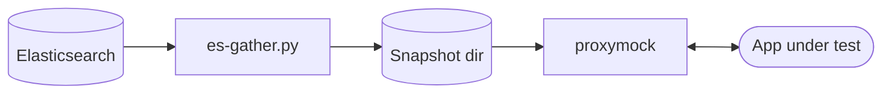

# Speedscale BYOC: Elasticsearch + Kibana

This reference architecture captures real traffic from your apps, ships it through the Speedscale Forwarder to your own Elasticsearch, and lets you slice it through Kibana — then pull any subset back out as a `proxymock`-replayable directory for tests.

Sibling scenario: [`charts/grafana/`](../grafana/) does the same with Loki + Grafana instead. The two coexist on one cluster (separate `byoc-*` namespaces); pick which receives traffic by repointing the Forwarder's `byoc_es.otel_endpoint`.

## Architecture

**Capture.** The Forwarder's `byoc_es` exporter ships RRPairs as OTLP logs into your own Elasticsearch via the OTel Collector. Kibana sits on top for indexing, Discover, and ad-hoc queries.


**Replay.** `es-gather.py` queries any subset of Elasticsearch back out and writes a `proxymock`-readable directory. Same real traffic you captured drives your tests.



## Prerequisites

- A Kubernetes cluster (any flavor — `kind`, `minikube`, EKS, GKE, AKS, k3s)
- `kubectl` configured against it
- `helm` v3
- A Speedscale API key and your app URL

## Install

```bash
helm repo add speedscale https://speedscale.github.io/operator-helm/
helm repo add speedscale-byoc https://speedscale.github.io/speedscale-byoc/
helm repo update

# Create the API key secret
kubectl create namespace speedscale
kubectl -n speedscale create secret generic speedscale-apikey \
  --from-literal=SPEEDSCALE_API_KEY="<YOUR_API_KEY>" \
  --from-literal=SPEEDSCALE_APP_URL="app.speedscale.com"

# 1. Speedscale Operator + Forwarder, wired to this chart's OTel Collector
helm upgrade --install speedscale-operator speedscale/speedscale-operator \
  -n speedscale --create-namespace \
  --set apiKeySecret=speedscale-apikey \
  --set clusterName=<YOUR_CLUSTER_NAME> \
  --set 'forwarder.exporters.byoc_es.otel_endpoint=http://otel-collector.byoc-elasticsearch.svc.cluster.local:4317' \
  --set 'forwarder.exporters.byoc_es.filter_rule=standard' \
  --set 'forwarder.exporters.byoc_es.dlp_config_id=standard'

# 2. BYOC backend (Elasticsearch + Kibana + OTel Collector)
helm upgrade --install byoc-elasticsearch speedscale-byoc/elasticsearch \
  -n byoc-elasticsearch --create-namespace
```

Annotate a workload to capture its traffic:

```bash
kubectl patch deployment my-app -p '{"spec":{"template":{"metadata":{"annotations":{"capture.speedscale.com/enabled":"true"}}}}}'
```

## Verify

Run these checks in order to confirm every hop is working.

**1. Forwarder is wired**

```bash
kubectl -n speedscale get cm speedscale-forwarder \
  -o jsonpath='{.data.EXPORTERS}' | jq .
```

Expected: a JSON object containing `byoc_es` with `otel_endpoint` pointing at `byoc-elasticsearch`. If `EXPORTERS` is `null`, the Operator values weren't applied.

**2. OTel Collector is receiving logs**

```bash
kubectl -n byoc-elasticsearch logs deploy/otel-collector --tail=50 | grep -E 'LogsExporter|otelcol'
```

Look for `log_records` counts > 0. Silence means the Forwarder isn't reaching the Collector.

**3. Elasticsearch has an index with data**

```bash
NODE_IP=$(kubectl get nodes -o jsonpath='{.items[0].status.addresses[?(@.type=="InternalIP")].address}')

curl -s "http://${NODE_IP}:30032/_cat/indices?v&h=index,docs.count,store.size"
```

The `speedscale-rrpair` index should appear with a non-zero `docs.count`.

**4. Kibana shows data**

Open `http://${NODE_IP}:30033`. Go to **Discover** → create a Data View on the `speedscale-rrpair*` index pattern with `@timestamp` as the time field. You should see RRPair documents with fields like `Body.command`, `Body.status`, `Attributes.service`.

> **Recommended columns to add:** `Resource.cluster`, `Attributes.service`, `Body.command`, `Body.status`, `Body.location`, `Body.duration`

## Troubleshoot

**`EXPORTERS` is null or missing `byoc_es`**

The Operator applied its default values and overwrote the forwarder config. Ensure you passed the `forwarder.exporters.byoc_es.*` flags on `helm upgrade`. After fixing, restart: `kubectl -n speedscale rollout restart deploy/speedscale-forwarder`.

**OTel Collector logs show no received records**

- Port mismatch: gRPC is **4317**. If you used `4318`, change to `4317`.
- Namespace mismatch: the endpoint must use the namespace you deployed the chart into.
- Network policy blocking cross-namespace traffic.

**`http://` prefix required on `otel_endpoint`**

Always use `http://otel-collector.<namespace>.svc.cluster.local:4317`, not a bare `host:port`.

**OTel Collector in CrashLoopBackOff**

Check: `kubectl -n byoc-elasticsearch logs deploy/otel-collector`. Usually a config syntax error. Run `helm template byoc-elasticsearch speedscale-byoc/elasticsearch -n byoc-elasticsearch | kubectl apply --dry-run=client -f -` to validate.

**ES JVM OOMKilled**

Default heap is `512m`. If ES is OOMKilled on nodes with < 2 GiB free, increase it:

```bash
helm upgrade byoc-elasticsearch speedscale-byoc/elasticsearch -n byoc-elasticsearch \
  --set elasticsearch.javaOpts="-Xms1g -Xmx1g" --reuse-values
```

**`Resource.cluster` shows correctly; `Body.cluster` reads `"undefined"`**

This is a known forwarder behavior on some versions. Use `Resource.cluster` — it is always populated correctly. The `es-gather.py` script already applies this workaround automatically.

**`es-gather.py` returns zero records**

- Confirm records exist in Kibana Discover first
- Check that `--service` matches the `Attributes.service` value exactly (case-sensitive)
- Widen `--start` (e.g. `-2h` instead of `-15m`)
- On `minikube --driver=docker`, use `kubectl port-forward svc/elasticsearch 30032:9200 -n byoc-elasticsearch` and pass `--es-url http://localhost:30032`

## Upgrade

```bash
helm repo update speedscale-byoc
helm upgrade byoc-elasticsearch speedscale-byoc/elasticsearch -n byoc-elasticsearch
```

ES index mappings are managed by the OTel Collector exporter and don't require migration between patch versions. Check the [CHANGELOG](CHANGELOG.md) for any breaking changes before upgrading major versions.

## Replay (gather a subset of traffic into proxymock)

```bash
NODE_IP=$(kubectl get nodes -o jsonpath='{.items[0].status.addresses[?(@.type=="InternalIP")].address}')

python3 ../../scripts/es-gather.py \
  --es-url   http://${NODE_IP}:30032 \
  --service  java-server \
  --status   2.. \
  --endpoint '^/api/.+' \
  --start    -1h \
  --out-dir  /tmp/snapshot

proxymock mock --in /tmp/snapshot
```

See [`scripts/README.md`](../../scripts/README.md) for all filter flags and workflow notes.

## Configuration reference

| Key | Default | Description |
|---|---|---|
| `nodePort.elasticsearch` | `30032` | NodePort for the Elasticsearch HTTP API |
| `nodePort.kibana` | `30033` | NodePort for the Kibana UI |
| `elasticsearch.javaOpts` | `"-Xms512m -Xmx512m"` | JVM heap settings for ES. Increase to `"-Xms1g -Xmx1g"` if OOMKilled. |
| `logsIndex` | `speedscale-rrpair` | Elasticsearch index name for RRPair documents |
| `image.elasticsearch` | `docker.elastic.co/elasticsearch/elasticsearch:8.14.3` | Elasticsearch image |
| `image.kibana` | `docker.elastic.co/kibana/kibana:8.14.3` | Kibana image |
| `image.otelCollector` | `otel/opentelemetry-collector-contrib:0.108.0` | OTel Collector image |
