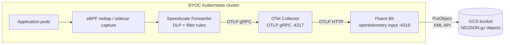

# Speedscale BYOC — Fluent Bit → GCS data-lake

Speedscale captures inbound + outbound traffic in the cluster and ships
RRPair logs through an OpenTelemetry Collector → Fluent Bit shipper → a
**Google Cloud Storage** bucket. Use this scenario when you want a durable
object-storage archive of every observed request/response — for compliance
retention, downstream replay/training pipelines, or BigQuery external
tables — instead of (or in addition to) a live query backend like
Elasticsearch or Loki.

## Architecture



`charts/grafana/` and `charts/elasticsearch/` (sibling scenarios) are live-query
backends — you see traffic in a dashboard. This scenario is the **archive**
path: data lands as partitioned NDJSON objects in GCS, ready for cheap
long-term retention and batch consumption.

## Why pick this over `grafana` or `elasticsearch`?

Pick `fluentbit` when:

- You need **durable retention** of every RRPair (compliance, audit, forensic replay) without paying ES/Loki hot-storage prices.
- You want to **feed downstream pipelines** — BigQuery external tables, Dataflow jobs, ML training corpora, proxymock snapshot generation — from a single canonical NDJSON corpus.
- You want **multi-region archive** or **lifecycle policies** (auto-tier to Nearline/Coldline/Archive) that GCS handles natively.

Pick `grafana` or `elasticsearch` when you need an interactive dashboard / live query UI.

The three scenarios coexist in their own namespaces; flip the forwarder's `byoc_otel.otel_endpoint` to switch which one receives traffic.

## Prerequisites

1. **GCS bucket** in a GCP project you control:
   ```bash
   gcloud storage buckets create gs://my-rrpair-archive \
     --project=my-project \
     --location=us-central1 \
     --uniform-bucket-level-access
   ```

2. **Service account** with Storage Object Admin on the bucket:
   ```bash
   gcloud iam service-accounts create byoc-fluentbit \
     --project=my-project

   gcloud storage buckets add-iam-policy-binding gs://my-rrpair-archive \
     --member=serviceAccount:byoc-fluentbit@my-project.iam.gserviceaccount.com \
     --role=roles/storage.objectAdmin
   ```

3. **HMAC credentials** (Fluent Bit uses GCS's S3-compatible XML API):
   ```bash
   gcloud storage hmac create \
     byoc-fluentbit@my-project.iam.gserviceaccount.com \
     --project=my-project
   # Prints accessId (GOOG1...) and secret — save both.
   ```

4. **Kubernetes Secret** with the HMAC creds (chart references it; does NOT manage it):
   ```bash
   kubectl create namespace byoc-fluentbit
   kubectl -n byoc-fluentbit create secret generic byoc-fluentbit-gcs \
     --from-literal=accessKeyId=GOOG1... \
     --from-literal=secretAccessKey=...
   ```

> **EKS / Workload Identity alternative:** HMAC credentials are the simplest path for any cluster. On EKS, you can also use IAM Roles for Service Accounts (IRSA) with a GCS interop-compatible setup, but HMAC is recommended unless you already have IRSA configured.

## Install

```bash
helm repo add speedscale https://speedscale.github.io/operator-helm/
helm repo add speedscale-byoc https://speedscale.github.io/speedscale-byoc/
helm repo update

# Speedscale Operator + Forwarder
helm upgrade --install speedscale-operator speedscale/speedscale-operator \
  -n speedscale --create-namespace \
  --set apiKeySecret=speedscale-apikey \
  --set clusterName=<YOUR_CLUSTER_NAME> \
  --set 'forwarder.exporters.byoc_otel.otel_endpoint=http://otel-collector.byoc-fluentbit.svc.cluster.local:4317' \
  --set 'forwarder.exporters.byoc_otel.filter_rule=standard' \
  --set 'forwarder.exporters.byoc_otel.dlp_config_id=standard'

# OTel Collector + Fluent Bit → GCS
helm upgrade --install byoc-fluentbit speedscale-byoc/fluentbit \
  -n byoc-fluentbit --create-namespace \
  --set gcs.bucket=my-rrpair-archive \
  --set gcs.region=us-central1
```

Annotate a workload to capture its traffic:

```bash
kubectl patch deployment my-app -p '{"spec":{"template":{"metadata":{"annotations":{"capture.speedscale.com/enabled":"true"}}}}}'
```

## Verify

**1. Forwarder is wired**

```bash
kubectl -n speedscale get cm speedscale-forwarder \
  -o jsonpath='{.data.EXPORTERS}' | jq .
```

Expected: JSON with `byoc_otel` and `otel_endpoint` pointing at `byoc-fluentbit`.

**2. OTel Collector is receiving logs**

```bash
kubectl -n byoc-fluentbit logs deploy/otel-collector --tail=50 | grep -E 'LogsExporter|log_records'
```

Non-zero `log_records` = Forwarder is delivering. Zero = check endpoint and port.

**3. Fluent Bit is shipping to GCS**

```bash
kubectl -n byoc-fluentbit logs deploy/fluent-bit --tail=50 | grep -E 'Uploaded|upload|error'
```

Look for `Uploaded` lines. If you see `AccessDenied` or `InvalidAccessKeyId`, check the Secret values and that the service account has `roles/storage.objectAdmin`.

**4. Objects appear in GCS**

```bash
gcloud storage ls -r gs://my-rrpair-archive/** | tail -10
```

Default partition layout: `year=YYYY/month=MM/day=DD/hour=HH/<uuid>-<index>.json.gz`. New objects appear within ~30s of traffic flowing (governed by `gcs.totalFileSize` and `gcs.uploadTimeout`).

**5. Peek at a record**

```bash
gcloud storage cat "$(gcloud storage ls gs://my-rrpair-archive/** | tail -1)" \
  | gunzip | head -1 | jq '{service: .service, command: .command, status: .status}'
```

## Troubleshoot

**`EXPORTERS` is null or missing `byoc_otel`**

Values weren't applied. Ensure you passed `forwarder.exporters.byoc_otel.*` on `helm upgrade`, then restart: `kubectl -n speedscale rollout restart deploy/speedscale-forwarder`.

**OTel Collector not receiving records**

- Port must be **4317** (gRPC). `4318` is the HTTP port — wrong for the Forwarder's gRPC dial.
- Namespace in the endpoint must match where you installed the chart.

**`http://` prefix required on `otel_endpoint`**

Always use `http://otel-collector.<namespace>.svc.cluster.local:4317`, not a bare `host:port`.

**Fluent Bit 3.x collapses log records**

FB 3.1.x's `opentelemetry` input collapses each `ResourceLogs` batch into a single record discarding individual `LogRecord` entries — you'll see objects with only metadata and no RRPair bodies. This chart pins **Fluent Bit 4.0.3** which fixes this. If you overrode the image, ensure it's ≥ 4.0.3.

**GCS `AccessDenied` / `403`**

- Confirm the service account has `roles/storage.objectAdmin` on the bucket (not just the project).
- Confirm the Secret `accessKeyId` starts with `GOOG1` and `secretAccessKey` is the corresponding HMAC secret (not a service account key JSON).
- HMAC keys expire — rotate with `gcloud storage hmac create` if the key is old.

**No objects appearing after several minutes**

Check Fluent Bit logs for upload errors. If logs show successful uploads but objects don't appear, verify the bucket name in `gcs.bucket` exactly matches the GCS bucket (case-sensitive, no `gs://` prefix).

**`gcs-gather.py` returns zero records**

- Confirm objects exist with `gcloud storage ls -r gs://<bucket>/**`
- Widen `--start` (e.g. `-2h`)
- Check that `--service` matches the `service` field in the NDJSON records exactly
- Pass `--dry-run` to see which GCS partitions the time window resolves to

## Upgrade

```bash
helm repo update speedscale-byoc
helm upgrade byoc-fluentbit speedscale-byoc/fluentbit -n byoc-fluentbit --reuse-values \
  --set gcs.bucket=my-rrpair-archive \
  --set gcs.region=us-central1
```

Objects already in GCS are unaffected by chart upgrades. Check the [CHANGELOG](CHANGELOG.md) for breaking changes to the Fluent Bit config before upgrading.

## Data shape

One OTLP LogRecord per NDJSON line. Fluent Bit's `s3` output flattens the RRPair body to the top level:

```json
{
  "@timestamp": "2026-05-25T15:04:30Z",
  "service": "java-server",
  "namespace": "speedscale",
  "msgType": "rrpair",
  "command": "GET",
  "status": "200",
  "duration": 1.0,
  "http": {
    "req": { "method": "GET", "url": "/api/...", "headers": {} },
    "res": { "statusCode": 200, "headers": {}, "bodyBase64": "..." }
  },
  "tags": { "captureMode": "eBPF" },
  "dlpModified": true
}
```

The Hive-style partition keys (`year=`, `month=`, `day=`, `hour=`) are designed for BigQuery external tables that auto-detect partitions.

## Replay from the archive

```bash
python3 ../../scripts/gcs-gather.py \
  --bucket   my-rrpair-archive \
  --service  java-server \
  --status   2.. \
  --start    -1h \
  --out-dir  /tmp/snapshot

proxymock mock --in /tmp/snapshot
```

Pass `--dry-run` first to see which GCS partitions the window touches before downloading. See [`scripts/README.md`](../../scripts/README.md) for all options.

## Configuration reference

| Key | Default | Description |
|---|---|---|
| `gcs.bucket` | `speedscale-rrpair-demo` | GCS bucket name (no `gs://` prefix) |
| `gcs.region` | `us-central1` | GCS bucket region — must match where the bucket was created |
| `gcs.endpoint` | `https://storage.googleapis.com` | GCS XML/Interop endpoint. Override for locational endpoints. |
| `gcs.credentialsSecret` | `byoc-fluentbit-gcs` | Name of the K8s Secret with `accessKeyId` + `secretAccessKey` |
| `gcs.keyFormat` | `/year=%Y/month=%m/day=%d/hour=%H/$UUID-$INDEX.json.gz` | Object key template. Hive-partitioned for BigQuery compatibility. |
| `gcs.totalFileSize` | `5M` | Flush to GCS when a batch reaches this size |
| `gcs.uploadTimeout` | `30s` | Flush to GCS after this time even if batch is smaller |
| `gcs.compression` | `gzip` | Output compression. `gzip` or `none`. |
| `image.otelCollector` | `otel/opentelemetry-collector-contrib:0.108.0` | OTel Collector image |
| `image.fluentBit` | `cr.fluentbit.io/fluent/fluent-bit:4.0.3` | Fluent Bit image — must be ≥ 4.0.3 |
