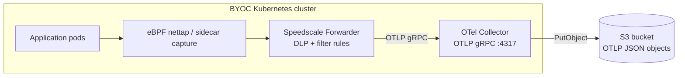

# Speedscale BYOC — OTel Collector to Amazon S3 data-lake

Speedscale captures inbound + outbound traffic in the cluster and ships
RRPair logs through an OpenTelemetry Collector to an **Amazon S3** bucket
as partitioned OTLP JSON objects.

> **Legacy name:** this chart still lives at `charts/fluentbit-s3` for
> compatibility with existing GitOps references. It does not deploy Fluent Bit.

Use this scenario when you want a durable object-storage archive on AWS —
for compliance retention, Athena/Glue queries, downstream ML pipelines,
or proxymock replay — without a live query backend.

> **GCS instead of S3?** See [`charts/fluentbit-gcs/`](../fluentbit-gcs/) — same architecture, different destination and auth model.

## Architecture



## Prerequisites

### 1. S3 bucket

```bash
aws s3api create-bucket \
  --bucket my-rrpair-archive \
  --region us-east-1
# For regions other than us-east-1, add:
# --create-bucket-configuration LocationConstraint=<region>

# Recommended: block public access
aws s3api put-public-access-block \
  --bucket my-rrpair-archive \
  --public-access-block-configuration "BlockPublicAcls=true,IgnorePublicAcls=true,BlockPublicPolicy=true,RestrictPublicBuckets=true"
```

### 2. IAM permissions

The OTel Collector pod needs `s3:PutObject` on the bucket. Use one of:

**Option A — Static credentials (any cluster)**

```json
{
  "Version": "2012-10-17",
  "Statement": [{
    "Effect": "Allow",
    "Action": ["s3:PutObject", "s3:GetObject", "s3:DeleteObject",
               "s3:CreateMultipartUpload", "s3:UploadPart",
               "s3:CompleteMultipartUpload", "s3:AbortMultipartUpload",
               "s3:ListBucket"],
    "Resource": ["arn:aws:s3:::my-rrpair-archive",
                 "arn:aws:s3:::my-rrpair-archive/*"]
  }]
}
```

Create an IAM user, attach the policy, generate an access key, then create the Secret:

```bash
kubectl create namespace byoc-s3
kubectl -n byoc-s3 create secret generic byoc-s3 \
  --from-literal=accessKeyId=AKIA... \
  --from-literal=secretAccessKey=...
```

**Option B — IRSA (EKS only, recommended)**

```bash
# Create IAM role with the policy above and a trust policy for your OIDC provider.
# Then set irsa.enabled=true and irsa.roleArn=arn:aws:iam::<account>:role/<role>
# No Secret needed — the pod picks up the role via projected token.
```

See [Amazon EKS IRSA documentation](https://docs.aws.amazon.com/eks/latest/userguide/iam-roles-for-service-accounts.html) for the full setup.

## Install

**Option A — Static credentials:**

```bash
helm repo add speedscale https://speedscale.github.io/operator-helm/
helm repo add speedscale-byoc https://speedscale.github.io/speedscale-byoc/
helm repo update

# Speedscale Operator + Forwarder
helm upgrade --install speedscale-operator speedscale/speedscale-operator \
  -n speedscale --create-namespace \
  --set apiKeySecret=speedscale-apikey \
  --set clusterName=<YOUR_CLUSTER_NAME> \
  --set 'forwarder.exporters.byoc_s3.otel_endpoint=http://otel-collector.byoc-s3.svc.cluster.local:4317' \
  --set 'forwarder.exporters.byoc_s3.filter_rule=standard' \
  --set 'forwarder.exporters.byoc_s3.dlp_config_id=standard'

# OTel Collector to S3 (static creds)
helm upgrade --install byoc-s3 speedscale-byoc/fluentbit-s3 \
  -n byoc-s3 --create-namespace \
  --set s3.bucket=my-rrpair-archive \
  --set s3.region=us-east-1 \
  --set s3.credentialsSecret=byoc-s3
```

**Option B — IRSA:**

```bash
helm upgrade --install byoc-s3 speedscale-byoc/fluentbit-s3 \
  -n byoc-s3 --create-namespace \
  --set s3.bucket=my-rrpair-archive \
  --set s3.region=us-east-1 \
  --set s3.credentialsSecret="" \
  --set irsa.enabled=true \
  --set irsa.roleArn=arn:aws:iam::<ACCOUNT_ID>:role/<ROLE_NAME> \
  --set irsa.serviceAccountName=byoc-s3
```

## Verify

**1. Forwarder is wired**

```bash
kubectl -n speedscale get cm speedscale-forwarder \
  -o jsonpath='{.data.EXPORTERS}' | jq .
```

Expected: `byoc_s3` with `otel_endpoint` pointing at `byoc-s3`.

**2. OTel Collector is receiving logs**

```bash
kubectl -n byoc-s3 logs deploy/otel-collector --tail=50 | grep -E 'log_records|otelcol'
```

Non-zero `log_records` = Forwarder is delivering.

**3. OTel Collector is uploading to S3**

```bash
kubectl -n byoc-s3 logs deploy/otel-collector --tail=50 | grep -E 'awss3|exporter|error'
```

If you see `AccessDenied`, check IAM permissions and credentials.

**4. Objects appear in S3**

```bash
aws s3 ls s3://my-rrpair-archive --recursive | tail -10
```

Default layout: `byoc/year=YYYY/month=MM/day=DD/hour=HH/minute=MM/logs_<timestamp>_<uuid>.json`. Objects appear within ~30s of traffic flowing.

**5. Peek at a record**

```bash
aws s3 cp "$(aws s3 ls s3://my-rrpair-archive --recursive | tail -1 | awk '{print "s3://my-rrpair-archive/"$4}')" - \
  | jq 'keys'
```

## Troubleshoot

**`EXPORTERS` is null or missing `byoc_s3`**

Values weren't applied. Pass `forwarder.exporters.byoc_s3.*` on `helm upgrade`, then restart: `kubectl -n speedscale rollout restart deploy/speedscale-forwarder`.

**OTel Collector not receiving records**

- Port must be **4317** (gRPC). Using `4318` is wrong for the Forwarder's gRPC dial.
- Namespace in the endpoint must match the release namespace.

**`http://` prefix required on `otel_endpoint`**

Always use `http://otel-collector.<namespace>.svc.cluster.local:4317`.

**OTel Collector: `NoCredentialProviders` / `AccessDenied`**

- Static creds: verify Secret name matches `s3.credentialsSecret`, keys are `accessKeyId` and `secretAccessKey`, and the IAM user has `s3:PutObject` on the bucket.
- IRSA: confirm the trust policy on the IAM role references your cluster's OIDC provider and the configured service account. Check the projected token is mounted: `kubectl -n byoc-s3 exec deploy/otel-collector -- env | grep AWS_WEB_IDENTITY`.

**Objects are too small or too numerous**

The current chart does not expose byte-size flush controls. The Collector path prioritizes OTLP correctness over Fluent Bit's S3 chunk controls.

**`s3-gather.py` returns zero records**

- Confirm objects exist with `aws s3 ls`
- Widen `--start` (e.g. `-2h`)
- Check `--service` matches the service field exactly (case-sensitive)
- Pass `--dry-run` to see which S3 prefixes the time window resolves to

## Upgrade

```bash
helm repo update speedscale-byoc
helm upgrade byoc-s3 speedscale-byoc/fluentbit-s3 -n byoc-s3 --reuse-values \
  --set s3.bucket=my-rrpair-archive \
  --set s3.region=us-east-1
```

Objects already in S3 are unaffected. Check the [CHANGELOG](CHANGELOG.md) for breaking changes.

## Data shape

Objects use the OTel `otlp_json` marshaler and Hive-style time partitions.

## Replay from the archive

```bash
python3 ../../scripts/s3-gather.py \
  --bucket   my-rrpair-archive \
  --region   us-east-1 \
  --service  java-server \
  --status   2.. \
  --start    -1h \
  --out-dir  /tmp/snapshot

proxymock mock --in /tmp/snapshot
```

Pass `--dry-run` first to see which S3 prefixes the window resolves to. See [`scripts/README.md`](../../scripts/README.md) for all options.

## Athena / Glue integration

Objects are written under Hive-style time partitions:
`byoc/year=YYYY/month=MM/day=DD/hour=HH/minute=MM/`.

The object body uses OTel JSON, not the old flattened RRPair NDJSON shape. Build
Athena tables from the actual OTel JSON structure you want to query.

## Configuration reference

| Key | Default | Description |
|---|---|---|
| `s3.bucket` | `my-rrpair-archive` | S3 bucket name |
| `s3.region` | `us-east-1` | AWS region where the bucket lives |
| `s3.credentialsSecret` | `byoc-s3` | K8s Secret with `accessKeyId` + `secretAccessKey`. Set to `""` for IRSA. |
| `irsa.enabled` | `false` | Enable IRSA (EKS only) — creates an annotated ServiceAccount |
| `irsa.roleArn` | `""` | IAM role ARN for IRSA. Required when `irsa.enabled=true`. |
| `irsa.serviceAccountName` | `byoc-s3` | Name of the ServiceAccount created when IRSA is enabled. |
| `image.otelCollector` | `otel/opentelemetry-collector-contrib:0.108.0` | OTel Collector image |
