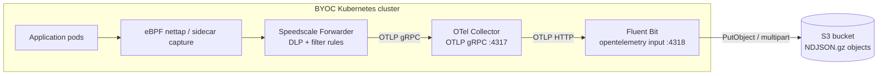

# Speedscale BYOC — Fluent Bit → Amazon S3 data-lake

Speedscale captures inbound + outbound traffic in the cluster and ships
RRPair logs through an OpenTelemetry Collector → Fluent Bit shipper → an
**Amazon S3** bucket as partitioned, gzipped NDJSON objects.

Use this scenario when you want a durable object-storage archive on AWS —
for compliance retention, Athena/Glue queries, downstream ML pipelines,
or proxymock replay — without a live query backend.

> **GCS instead of S3?** See [`charts/fluentbit-gcs/`](../fluentbit-gcs/) — same architecture, different destination and auth model.

## Architecture



## Prerequisites

### 1. S3 bucket

```bash
aws s3api create-bucket \
  --bucket my-rrpair-archive \
  --region us-east-1
# For regions other than us-east-1, add:
# --create-bucket-configuration LocationConstraint=<region>

# Recommended: block public access
aws s3api put-public-access-block \
  --bucket my-rrpair-archive \
  --public-access-block-configuration "BlockPublicAcls=true,IgnorePublicAcls=true,BlockPublicPolicy=true,RestrictPublicBuckets=true"
```

### 2. IAM permissions

The Fluent Bit pod needs `s3:PutObject` (and `s3:CreateMultipartUpload`, `s3:UploadPart`, `s3:CompleteMultipartUpload`, `s3:AbortMultipartUpload`) on the bucket. Use one of:

**Option A — Static credentials (any cluster)**

```json
{
  "Version": "2012-10-17",
  "Statement": [{
    "Effect": "Allow",
    "Action": ["s3:PutObject", "s3:GetObject", "s3:DeleteObject",
               "s3:CreateMultipartUpload", "s3:UploadPart",
               "s3:CompleteMultipartUpload", "s3:AbortMultipartUpload",
               "s3:ListBucket"],
    "Resource": ["arn:aws:s3:::my-rrpair-archive",
                 "arn:aws:s3:::my-rrpair-archive/*"]
  }]
}
```

Create an IAM user, attach the policy, generate an access key, then create the Secret:

```bash
kubectl create namespace byoc-fluentbit-s3
kubectl -n byoc-fluentbit-s3 create secret generic byoc-fluentbit-s3 \
  --from-literal=accessKeyId=AKIA... \
  --from-literal=secretAccessKey=...
```

**Option B — IRSA (EKS only, recommended)**

```bash
# Create IAM role with the policy above and a trust policy for your OIDC provider.
# Then set irsa.enabled=true and irsa.roleArn=arn:aws:iam::<account>:role/<role>
# No Secret needed — the pod picks up the role via projected token.
```

See [Amazon EKS IRSA documentation](https://docs.aws.amazon.com/eks/latest/userguide/iam-roles-for-service-accounts.html) for the full setup.

## Install

**Option A — Static credentials:**

```bash
helm repo add speedscale https://speedscale.github.io/operator-helm/
helm repo add speedscale-byoc https://speedscale.github.io/speedscale-byoc/
helm repo update

# Speedscale Operator + Forwarder
helm upgrade --install speedscale-operator speedscale/speedscale-operator \
  -n speedscale --create-namespace \
  --set apiKeySecret=speedscale-apikey \
  --set clusterName=<YOUR_CLUSTER_NAME> \
  --set 'forwarder.exporters.byoc_otel.otel_endpoint=http://otel-collector.byoc-fluentbit-s3.svc.cluster.local:4317' \
  --set 'forwarder.exporters.byoc_otel.filter_rule=standard' \
  --set 'forwarder.exporters.byoc_otel.dlp_config_id=standard'

# OTel Collector + Fluent Bit → S3 (static creds)
helm upgrade --install byoc-fluentbit-s3 speedscale-byoc/fluentbit-s3 \
  -n byoc-fluentbit-s3 --create-namespace \
  --set s3.bucket=my-rrpair-archive \
  --set s3.region=us-east-1
```

**Option B — IRSA:**

```bash
helm upgrade --install byoc-fluentbit-s3 speedscale-byoc/fluentbit-s3 \
  -n byoc-fluentbit-s3 --create-namespace \
  --set s3.bucket=my-rrpair-archive \
  --set s3.region=us-east-1 \
  --set s3.credentialsSecret="" \
  --set irsa.enabled=true \
  --set irsa.roleArn=arn:aws:iam::<ACCOUNT_ID>:role/<ROLE_NAME>
```

## Verify

**1. Forwarder is wired**

```bash
kubectl -n speedscale get cm speedscale-forwarder \
  -o jsonpath='{.data.EXPORTERS}' | jq .
```

Expected: `byoc_otel` with `otel_endpoint` pointing at `byoc-fluentbit-s3`.

**2. OTel Collector is receiving logs**

```bash
kubectl -n byoc-fluentbit-s3 logs deploy/otel-collector --tail=50 | grep -E 'log_records|otelcol'
```

Non-zero `log_records` = Forwarder is delivering.

**3. Fluent Bit is uploading to S3**

```bash
kubectl -n byoc-fluentbit-s3 logs deploy/fluent-bit --tail=50 | grep -E 'Uploaded|upload|error'
```

Look for `Uploaded` messages. If you see `AccessDenied`, check IAM permissions and credentials.

**4. Objects appear in S3**

```bash
aws s3 ls s3://my-rrpair-archive --recursive | tail -10
```

Default layout: `year=YYYY/month=MM/day=DD/hour=HH/<uuid>-<index>.json.gz`. Objects appear within ~30s of traffic flowing.

**5. Peek at a record**

```bash
aws s3 cp "$(aws s3 ls s3://my-rrpair-archive --recursive | tail -1 | awk '{print "s3://my-rrpair-archive/"$4}')" - \
  | gunzip | head -1 | jq '{service: .service, command: .command, status: .status}'
```

## Troubleshoot

**`EXPORTERS` is null or missing `byoc_otel`**

Values weren't applied. Pass `forwarder.exporters.byoc_otel.*` on `helm upgrade`, then restart: `kubectl -n speedscale rollout restart deploy/speedscale-forwarder`.

**OTel Collector not receiving records**

- Port must be **4317** (gRPC). Using `4318` is wrong for the Forwarder's gRPC dial.
- Namespace in the endpoint must match the release namespace.

**`http://` prefix required on `otel_endpoint`**

Always use `http://otel-collector.<namespace>.svc.cluster.local:4317`.

**Fluent Bit: `NoCredentialProviders` / `AccessDenied`**

- Static creds: verify Secret name matches `s3.credentialsSecret`, keys are `accessKeyId` and `secretAccessKey`, and the IAM user has `s3:PutObject` on the bucket.
- IRSA: confirm the trust policy on the IAM role references your cluster's OIDC provider and the `byoc-fluentbit-s3` service account. Check the projected token is mounted: `kubectl -n byoc-fluentbit-s3 exec deploy/fluent-bit -- env | grep AWS_WEB_IDENTITY`.

**Fluent Bit 3.x collapses log records**

FB 3.1.x's `opentelemetry` input discards individual `LogRecord` entries. The chart pins **Fluent Bit 4.0.3**. If you overrode the image, ensure it's ≥ 4.0.3.

**Objects appear in S3 but bodies are empty**

Fluent Bit may have run out of buffer space. Check `store_dir` (`/var/fluent-bit/buffer`) is writable and the emptyDir isn't size-constrained by the cluster's node config.

**`s3-gather.py` returns zero records**

- Confirm objects exist with `aws s3 ls`
- Widen `--start` (e.g. `-2h`)
- Check `--service` matches the `service` field in the NDJSON exactly (case-sensitive)
- Pass `--dry-run` to see which S3 prefixes the time window resolves to

## Upgrade

```bash
helm repo update speedscale-byoc
helm upgrade byoc-fluentbit-s3 speedscale-byoc/fluentbit-s3 -n byoc-fluentbit-s3 --reuse-values \
  --set s3.bucket=my-rrpair-archive \
  --set s3.region=us-east-1
```

Objects already in S3 are unaffected. Check the [CHANGELOG](CHANGELOG.md) for breaking changes.

## Data shape

Identical to `fluentbit-gcs` — one OTLP LogRecord per NDJSON line, Hive-partitioned. See [`charts/fluentbit-gcs/README.md`](../fluentbit-gcs/README.md#data-shape) for the full record schema.

## Replay from the archive

```bash
python3 ../../scripts/s3-gather.py \
  --bucket   my-rrpair-archive \
  --region   us-east-1 \
  --service  java-server \
  --status   2.. \
  --start    -1h \
  --out-dir  /tmp/snapshot

proxymock mock --in /tmp/snapshot
```

Pass `--dry-run` first to see which S3 prefixes the window resolves to. See [`scripts/README.md`](../../scripts/README.md) for all options.

## Athena / Glue integration

The default key format (`year=YYYY/month=MM/day=DD/hour=HH/`) is designed for Glue auto-discovery. To create an Athena table:

```sql
CREATE EXTERNAL TABLE rrpairs (
  `@timestamp`  string,
  service       string,
  namespace     string,
  msgType       string,
  command       string,
  status        string,
  duration      double,
  http          struct<req:struct<method:string,url:string>,res:struct<statusCode:int>>
)
PARTITIONED BY (year string, month string, day string, hour string)
ROW FORMAT SERDE 'org.openx.data.jsonserde.JsonSerDe'
LOCATION 's3://my-rrpair-archive/'
TBLPROPERTIES ('has_encrypted_data'='false');

MSCK REPAIR TABLE rrpairs;
```

## Configuration reference

| Key | Default | Description |
|---|---|---|
| `s3.bucket` | `my-rrpair-archive` | S3 bucket name |
| `s3.region` | `us-east-1` | AWS region where the bucket lives |
| `s3.credentialsSecret` | `byoc-fluentbit-s3` | K8s Secret with `accessKeyId` + `secretAccessKey`. Set to `""` for IRSA. |
| `s3.keyFormat` | `/year=%Y/month=%m/day=%d/hour=%H/$UUID-$INDEX.json.gz` | Object key template (strftime + FB vars) |
| `s3.totalFileSize` | `5M` | Flush to S3 when batch reaches this size |
| `s3.uploadTimeout` | `30s` | Flush to S3 after this time even if batch is smaller |
| `s3.compression` | `gzip` | Output compression: `gzip` or `none` |
| `irsa.enabled` | `false` | Enable IRSA (EKS only) — creates an annotated ServiceAccount |
| `irsa.roleArn` | `""` | IAM role ARN for IRSA. Required when `irsa.enabled=true`. |
| `irsa.serviceAccountName` | `byoc-fluentbit-s3` | Name of the ServiceAccount created when IRSA is enabled |
| `image.otelCollector` | `otel/opentelemetry-collector-contrib:0.108.0` | OTel Collector image |
| `image.fluentBit` | `cr.fluentbit.io/fluent/fluent-bit:4.0.3` | Fluent Bit image — must be ≥ 4.0.3 |
