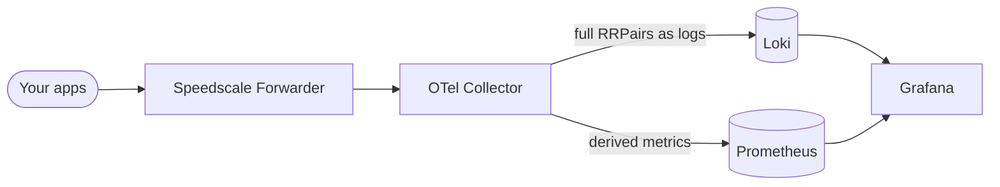
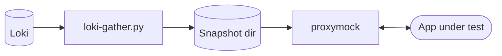

# Speedscale BYOC: Grafana + Loki

This reference architecture captures real traffic from your apps, ships it through the Speedscale Forwarder to your own Loki, and lets you slice it through Grafana — then pull any subset back out as a `proxymock`-replayable directory for tests.

## Architecture

**Capture.** The Forwarder's `byoc_otel` exporter ships RRPairs as OTLP logs into the bundled OTel Collector — no Speedscale Cloud round-trip. The Collector fans that single stream out to two destinations:

- **Loki** receives the full RRPair logs for endpoint-level drill-down and replay pull-out.
- **Prometheus** receives derived traffic metrics (using OTel `count` + `sum` connectors) for the dashboard's aggregate panels.



**Metrics.** The Collector derives two metrics from the RRPair log stream and remote-writes them to Prometheus — the forwarder sends nothing twice:

| Metric | Labels | Description |
|---|---|---|
| `speedscale_calls_total` | `svc`, `status` | Request count by service and HTTP status code |
| `speedscale_request_duration_ms_sum_total` | `svc` | Summed request duration in milliseconds by service |

The Grafana dashboard's aggregate panels (Requests, Error rate, Status distribution, Request rate by service, Avg latency, Avg latency by service) read PromQL from Prometheus. These are fixed-cardinality queries that stay fast regardless of time window or endpoint count. Loki still backs the endpoint-level panels (Distinct endpoints, Top endpoints, Recent traffic) and the replay pull-out.

> **Note on latency percentiles:** The current latency panels show *average* latency derived from summed logs. True p50/p95/p99 percentiles require span-level histograms (the `spanmetrics` connector) and are a planned follow-up — average is accurate but not a substitute for a true percentile distribution.

**Replay.** `loki-gather.py` queries any subset of Loki back out and writes a `proxymock`-readable directory. Same real traffic you captured drives your tests.



## Prerequisites

- A Kubernetes cluster (any flavor — `kind`, `minikube`, EKS, GKE, AKS, k3s)
- `kubectl` configured against it
- `helm` v3
- A Speedscale API key (`SPEEDSCALE_API_KEY`) and your app URL

## Install

```bash
helm repo add speedscale https://speedscale.github.io/operator-helm/
helm repo add speedscale-byoc https://speedscale.github.io/speedscale-byoc/
helm repo update

# Create the API key secret
kubectl create namespace speedscale
kubectl -n speedscale create secret generic speedscale-apikey \
  --from-literal=SPEEDSCALE_API_KEY="<YOUR_API_KEY>" \
  --from-literal=SPEEDSCALE_APP_URL="app.speedscale.com"

# 1. Speedscale Operator + Forwarder, wired to this chart's OTel Collector
helm upgrade --install speedscale-operator speedscale/speedscale-operator \
  -n speedscale --create-namespace \
  --set apiKeySecret=speedscale-apikey \
  --set clusterName=<YOUR_CLUSTER_NAME> \
  --set 'forwarder.exporters.byoc_otel.otel_endpoint=http://otel-collector.byoc-grafana.svc.cluster.local:4317' \
  --set 'forwarder.exporters.byoc_otel.filter_rule=standard' \
  --set 'forwarder.exporters.byoc_otel.dlp_config_id=standard'

# 2. BYOC backend (Loki + Grafana + OTel Collector + Prometheus)
helm upgrade --install byoc-grafana speedscale-byoc/grafana \
  -n byoc-grafana --create-namespace
```

Annotate a workload to capture its traffic:

```bash
kubectl patch deployment my-app -p '{"spec":{"template":{"metadata":{"annotations":{"capture.speedscale.com/enabled":"true"}}}}}'
```

## Verify

Run these checks in order to confirm every hop is working.

**1. Forwarder is wired**

```bash
kubectl -n speedscale get cm speedscale-forwarder \
  -o jsonpath='{.data.EXPORTERS}' | jq .
```

Expected output contains `byoc_otel` with your endpoint. If `EXPORTERS` is `null` or missing `byoc_otel`, the Operator values weren't applied — recheck step 1 of the install.

**2. OTel Collector is receiving logs**

```bash
kubectl -n byoc-grafana logs deploy/otel-collector --tail=50 | grep -E 'LogsExporter|otelcol'
```

Look for lines like `"otelcol/logsexporter"` with non-zero `log_records`. Silence here means the Forwarder isn't reaching the Collector — check the endpoint and port.

**3. Loki is ready and receiving data**

```bash
NODE_IP=$(kubectl get nodes -o jsonpath='{.items[0].status.addresses[?(@.type=="InternalIP")].address}')

# Health check
curl -s "http://${NODE_IP}:30031/ready"
# → ready

# Query for any RRPair record
curl -s "http://${NODE_IP}:30031/loki/api/v1/query_range" \
  --data-urlencode 'query={cluster=~".+"}' \
  --data-urlencode 'limit=1' \
  --data-urlencode 'start=0' | jq '.data.result | length'
# → should be > 0 once traffic is flowing
```

**4. Grafana shows data**

Open `http://${NODE_IP}:30030` (admin/admin). Go to Explore → select the Loki datasource → run `{cluster=~".+"}`. You should see log lines with RRPair JSON. The **Speedscale BYOC** and **Speedscale Traffic** dashboards are auto-provisioned under Home → Dashboards.

## Troubleshoot

**`EXPORTERS` is null or missing `byoc_otel`**

The Operator applied its default values and overwrote the forwarder config. Ensure you passed `--set forwarder.exporters.byoc_otel.*` (or `-f operator-values.yaml`) on your `helm upgrade`. After fixing, restart the forwarder: `kubectl -n speedscale rollout restart deploy/speedscale-forwarder`.

**OTel Collector logs show no received records**

The Forwarder can't reach the Collector. Common causes:
- Wrong namespace in the endpoint (must match the `-n` you used for `byoc-grafana`)
- Port mismatch: the OTel Collector gRPC port is **4317** — if you used `4318`, change it to `4317`
- Network policy blocking cross-namespace traffic

**`http://` prefix required on `otel_endpoint`**

The Forwarder's gRPC dial requires a scheme prefix. Always use `http://otel-collector.<namespace>.svc.cluster.local:4317`, not just `otel-collector.<namespace>.svc.cluster.local:4317`.

**OTel Collector in CrashLoopBackOff**

Check logs: `kubectl -n byoc-grafana logs deploy/otel-collector`. Usually a YAML/indentation error in the ConfigMap. Run `helm template byoc-grafana speedscale-byoc/grafana -n byoc-grafana | kubectl apply --dry-run=client -f -` to catch config errors before applying.

**Loki PVC full**

```bash
kubectl -n byoc-grafana get pvc
```

If `loki-storage` is at 100%, either increase `storage.loki` (requires recreating the PVC) or reduce `retention.loki`. For demo use `24h` is usually sufficient; reduce to `6h` if running repeated load tests.

**`loki-gather.py` returns zero records**

- Confirm records exist in Grafana Explore first
- Check that `--service` matches exactly (case-sensitive stream label)
- Widen `--start` (e.g. `-2h` instead of `-15m`)
- On `minikube --driver=docker`, the NodePort isn't routable from the host — use `kubectl port-forward svc/loki 30031:3100 -n byoc-grafana` and point `--loki-url http://localhost:30031`

## Upgrade

```bash
helm repo update speedscale-byoc
helm upgrade byoc-grafana speedscale-byoc/grafana -n byoc-grafana
```

Check the [CHANGELOG](CHANGELOG.md) before upgrading — breaking changes to the OTel Collector config or Loki schema require draining data first.

To upgrade images only without changing chart values:

```bash
helm upgrade byoc-grafana speedscale-byoc/grafana -n byoc-grafana \
  --set image.loki=grafana/loki:3.0.0 \
  --reuse-values
```

## Replay (gather a subset of traffic into proxymock)

```bash
NODE_IP=$(kubectl get nodes -o jsonpath='{.items[0].status.addresses[?(@.type=="InternalIP")].address}')

python3 ../../scripts/loki-gather.py \
  --loki-url http://${NODE_IP}:30031 \
  --service  java-server \
  --status   2.. \
  --endpoint '^/api/.+' \
  --start    -1h \
  --out-dir  /tmp/snapshot

proxymock mock --in /tmp/snapshot
```

See [`scripts/README.md`](../../scripts/README.md) for all filter flags and workflow notes.

## Configuration reference

| Key | Default | Description |
|---|---|---|
| `nodePort.grafana` | `30030` | NodePort for the Grafana UI |
| `nodePort.loki` | `30031` | NodePort for the Loki HTTP API (used by `loki-gather.py`) |
| `storage.loki` | `5Gi` | PVC size for Loki chunks + index |
| `storage.grafana` | `2Gi` | PVC size for Grafana dashboards + plugins |
| `retention.loki` | `24h` | How long Loki keeps log data (e.g. `24h`, `168h`, `720h`) |
| `retention.prometheus` | `24h` | How long Prometheus keeps metrics |
| `grafana.adminUser` | `admin` | Grafana admin username |
| `grafana.adminPassword` | `admin` | Grafana admin password — **change this for any shared environment** |
| `image.loki` | `grafana/loki:2.9.8` | Loki container image |
| `image.grafana` | `grafana/grafana:11.1.4` | Grafana container image |
| `image.prometheus` | `prom/prometheus:v2.54.1` | Prometheus container image |
| `image.otelCollector` | `otel/opentelemetry-collector-contrib:0.108.0` | OTel Collector image |
