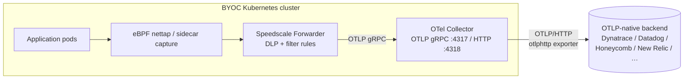

# Speedscale BYOC — OTLP backend (any OTLP-native vendor)

Ship Speedscale BYOC RRPair logs to **any OTLP-native observability backend** —
Dynatrace, Datadog, Honeycomb, New Relic, and others. Every OTLP-native vendor
uses the **identical** OTel Collector with an `otlphttp` exporter; only the logs
endpoint URL and the auth header differ. So instead of one chart per vendor,
this is **one parameterized chart** configured by a per-vendor values preset
(see [`examples/`](examples/)).

## Architecture



The forwarder's `byoc_<vendor>` exporter ships RRPairs over OTLP gRPC into this
chart's Collector, which re-exports them over OTLP/HTTP to the vendor's logs
endpoint. The destination URL and auth header come from values; the API token
comes from a K8s Secret at runtime.

## Prerequisites

1. **The backend's OTLP logs endpoint** (the exact `/v1/logs` URL — see the
   vendor preset table below).
2. **An API token / key** for that backend.
3. **A Kubernetes Secret** holding that token under data key `token` (the chart
   references it; it does NOT manage it):
   ```bash
   kubectl create namespace byoc-<vendor>
   kubectl -n byoc-<vendor> create secret generic byoc-<vendor> \
     --from-literal=token=<KEY>
   ```

## Install

Use a vendor preset from [`examples/`](examples/) and edit the endpoint:

```bash
helm repo add speedscale https://speedscale.github.io/operator-helm/
helm repo add speedscale-byoc https://speedscale.github.io/speedscale-byoc/
helm repo update

# Speedscale Operator + Forwarder, wired to this Collector
helm upgrade --install speedscale-operator speedscale/speedscale-operator \
  -n speedscale --create-namespace \
  --set apiKeySecret=speedscale-apikey \
  --set clusterName=<YOUR_CLUSTER_NAME> \
  --set 'forwarder.exporters.byoc_dynatrace.otel_endpoint=http://otel-collector.byoc-dynatrace.svc.cluster.local:4317' \
  --set 'forwarder.exporters.byoc_dynatrace.filter_rule=standard' \
  --set 'forwarder.exporters.byoc_dynatrace.dlp_config_id=standard'

# OTel Collector → OTLP backend (Dynatrace preset shown)
helm upgrade --install byoc-dynatrace speedscale-byoc/otlp \
  -n byoc-dynatrace --create-namespace \
  -f charts/otlp/examples/dynatrace.yaml
```

Annotate a workload to capture its traffic:

```bash
kubectl patch deployment my-app -p '{"spec":{"template":{"metadata":{"annotations":{"capture.speedscale.com/enabled":"true"}}}}}'
```

## Vendor presets

| Vendor | Logs endpoint | `headerName` | `headerPrefix` |
|---|---|---|---|
| Dynatrace | `https://<env-id>.live.dynatrace.com/api/v2/otlp/v1/logs` | `Authorization` | `Api-Token ` |
| Datadog | site-specific OTLP logs intake URL (see docs.datadoghq.com) | `dd-api-key` | *(empty)* |
| Honeycomb | `https://api.honeycomb.io/v1/logs` | `x-honeycomb-team` | *(empty)* |
| New Relic | `https://otlp.nr-data.net/v1/logs` | `api-key` | *(empty)* |

The token/key is appended after `headerPrefix` from the Secret at runtime, so
the rendered header is e.g. `Authorization: "Api-Token <token>"` for Dynatrace
or `dd-api-key: "<token>"` for Datadog. Adding a new OTLP-native vendor is just
a new preset file — no template change.

## Wire the Forwarder

Add **one** `byoc_<vendor>` exporter pointed at this chart's Collector Service,
with its own DLP + filter policy:

```bash
--set 'forwarder.exporters.byoc_<vendor>.otel_endpoint=http://otel-collector.byoc-<vendor>.svc.cluster.local:4317'
--set 'forwarder.exporters.byoc_<vendor>.filter_rule=standard'
--set 'forwarder.exporters.byoc_<vendor>.dlp_config_id=standard'
```

Always use the `http://...:4317` (gRPC) form — `4318` is HTTP and is wrong for
the Forwarder's gRPC dial.

## Verify

**1. OTel Collector is receiving + exporting**

```bash
kubectl -n byoc-<vendor> logs deploy/otel-collector --tail=50 | grep -E 'LogsExporter|log_records'
```

Non-zero `log_records` = the Forwarder is delivering and the Collector is
exporting successfully. The `otlphttp` exporter logs export errors here too.

**2. View in the vendor's Logs UI**

Open the backend's logs view (Dynatrace Logs, Datadog Logs, Honeycomb, New
Relic Logs) and filter for recently-arrived records. New RRPairs appear within
~30s of traffic flowing.

## Troubleshoot

**`401 Unauthorized`** — the auth header name/prefix or the token is wrong.
Confirm `otlp.headerName` / `otlp.headerPrefix` match the vendor preset table
and that the Secret's `token` value is the correct key (and not expired).

**`404 Not Found`** — the endpoint URL or path is wrong. Use the EXACT logs
endpoint (`logs_endpoint`), including the vendor's full path (e.g. Dynatrace
`/api/v2/otlp/v1/logs`, not just the host).

**Payload rejected / `413` / `400`** — the backend's ingest limits (max body
size, attribute count, rate). Lower throughput via the Forwarder's
`filter_rule`, or check the vendor's OTLP ingest limits docs.

**Collector not receiving records** — endpoint port must be **4317** (gRPC) and
the namespace in the Forwarder's `otel_endpoint` must match where this chart is
installed.

## Upgrade

```bash
helm repo update speedscale-byoc
helm upgrade byoc-dynatrace speedscale-byoc/otlp -n byoc-dynatrace --reuse-values \
  -f charts/otlp/examples/dynatrace.yaml
```

Check the [CHANGELOG](CHANGELOG.md) for breaking changes before upgrading.

## Configuration reference

| Key | Default | Description |
|---|---|---|
| `otlp.endpoint` | `https://CHANGEME/v1/logs` | EXACT OTLP logs endpoint URL (full path) |
| `otlp.headerName` | `Authorization` | Auth header name |
| `otlp.headerPrefix` | `""` | Value prefix prepended to the token (e.g. `Api-Token ` for Dynatrace) |
| `otlp.tokenSecret` | `byoc-otlp` | K8s Secret name holding the token under data key `token` |
| `otlp.compression` | `gzip` | OTLP/HTTP request compression (`gzip` or `none`) |
| `image.otelCollector` | `otel/opentelemetry-collector-contrib:0.108.0` | OTel Collector image |
