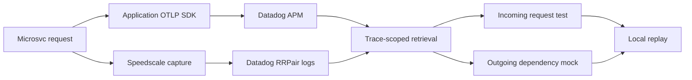

# Datadog trace to runnable test

## Story

Start with one real `GET /api/accounts` request in the microsvc banking app. Show its APM trace and matching Speedscale RRPair logs in the dedicated Datadog partner organization. Retrieve those logs by trace ID, use the inbound request as a regression test, and use the outbound account-service call as a dependency mock. Run a baseline, inject HTTP 503, and show recovery.

GCS, S3, and Dynatrace are separate channels and are not part of this walkthrough.

## Rehearse

Run `gather.py` with a fresh trace, then run `demo.py` once without `--interactive`. Confirm baseline HTTP 200/body match/exit 0, fault HTTP 503/exit 1, and recovery HTTP 200/body match/exit 0. Open the report and both Datadog links in the partner organization.

Keep Docker running and ports 18080, 18082, 14140, and 14141 free. Use a new output directory for each run. Do not display credentials or raw Authorization headers.

## Eight-minute walkthrough

| Time | Show | Say |
|---|---|---|
| 0:00-1:00 | `GET /api/accounts` in Datadog APM | The application SDK emitted this trace. |
| 1:00-2:00 | Matching `@msgType:rrpair` logs | Speedscale captured the request and response; the trace ID correlates them. |
| 2:00-3:00 | Retrieval counts and provenance | The inbound record becomes the test and the outbound record becomes the mock. |
| 3:00-5:00 | Baseline replay | The real gateway returns the recorded dependency response with passthrough disabled. |
| 5:00-6:30 | Injected 503 | The same regression test fails when the dependency behavior changes. |
| 6:30-7:00 | Recovery | Removing the fault restores the exact match. |
| 7:00-8:00 | Discussion | This connects an observed Datadog trace to a repeatable local test. |

## Boundaries

APM spans alone cannot reconstruct the test. The demo works because the dedicated Datadog channel contains complete Speedscale request/response RRPairs alongside application spans. The captured response is a regression baseline, not proof that the original business behavior was correct. Add explicit business assertions when expected behavior differs from the recording.

The runner changes authentication only in a local copy, preserves response assertions, disables dependency passthrough, and exports no new telemetry. If the live segment fails, show a previously executed report with its timestamp and describe it as a rehearsal.
