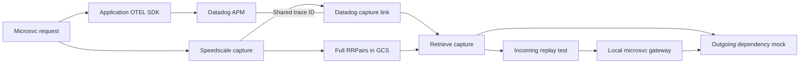

# From a Datadog trace to a runnable test

## What to demonstrate

Start with one real request in the microsvc banking app. Show its application-generated APM trace and the Speedscale capture log in the dedicated Datadog partner account. Resolve that log's GCS link into recorded requests and responses. Run the gateway locally with the recorded account-service response, then inject an HTTP 503 and show the same test fail. Remove the fault and show recovery.

The important result is an executable regression case tied to the request under investigation. Datadog supplies the investigation starting point. Speedscale supplies the payloads and dependency recordings needed to reproduce the interaction.

## Before the call

Rehearse the runner once without `--interactive`. Confirm baseline HTTP 200/body match/exit 0, fault HTTP 503/exit 1, and recovery HTTP 200/body match/exit 0. Open the generated report and both Datadog links in the partner organization. Use a fresh trace for live retrieval: gather.py searches the past 24 hours, and account retention determines how long older traces remain visible.

Have two screens ready: Datadog for the original trace and capture log, and a terminal for the runner. Use a new output directory for the presentation. The script cleans up after itself; keep Docker running. No credentials or raw Authorization headers should be visible in the shared terminal. The result page omits captured payloads.

## Proposed eight-minute walkthrough

| Time | Show | Explain |
| --- | --- | --- |
| 0:00-1:00 | `GET /api/accounts` in Datadog APM | The application SDK emitted these spans. We will reproduce this request locally. |
| 1:00-2:00 | Matching capture log and GCS link | Speedscale captured the request and response. The trace ID connects the APM view to the recording. |
| 2:00-3:00 | Retrieval counts and provenance | One incoming request becomes the test. One outgoing account-service recording becomes the mock. Payloads stay in GCS until retrieved. |
| 3:00-5:00 | Interactive baseline run | The real microsvc gateway returns the recorded response while the account service is replaced by its capture. Passthrough is disabled. |
| 5:00-6:00 | Injected 503 and failing test | The same test catches a changed dependency status and exits 1. Its expected response has not changed. |
| 6:00-7:00 | Recovery and generated report | Removing the fault restores a passing result. The report retains the source trace and concrete outcomes. |
| 7:00-8:00 | Discussion | Is this a useful path from a Datadog investigation to a reproducible test? Where should that action appear in the user's workflow? |

## Scope to state accurately

This example uses the microsvc application and one gateway HTTP route. Redis runs locally to support the gateway; the account dependency is mocked. The original request's APM data and capture log live in the dedicated partner account. Local replay emits no new Datadog telemetry.

The runner refreshes authentication in an isolated local copy. The original recording and response assertions are unchanged. A recorded response is a regression baseline; it does not establish that the original business behavior was correct.

APM spans and ordinary summary logs alone cannot reconstruct this test. It works because Speedscale stored the actual request/response pairs and Datadog links to them. The original GKE capture used the development forwarder harness; this demonstration does not establish public-release deployment qualification.

## If the live segment fails

Stop at the actual failure and inspect the local logs. Use the saved rehearsal report to show the previously executed result, with its timestamp visible. Do not describe a cached report as a fresh live run. An unrelated replay error is not a successful fault demonstration; the runner specifically checks observed HTTP 503 for that phase.
